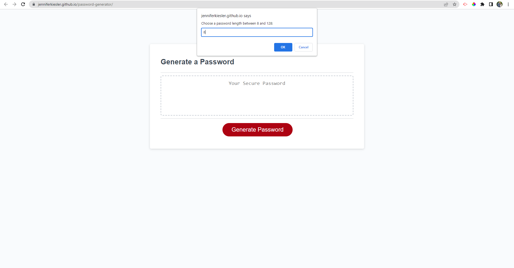

# Password Generator

## Description

This application is used to generate a random password based on criteria that is selected.

When the generate password button is clicked, a series of prompts for the password criteria is presented:
- length of password (needs to be between 8 and 128)
- whether or not to include lowercase
- whether or not to include uppercase
- whether or not to include numbers
- whether or not to include special characters

For each prompt the input is validated and at least one character type (lowercase, uppercase, numeric, or special characters) should be selected.

## Visuals

